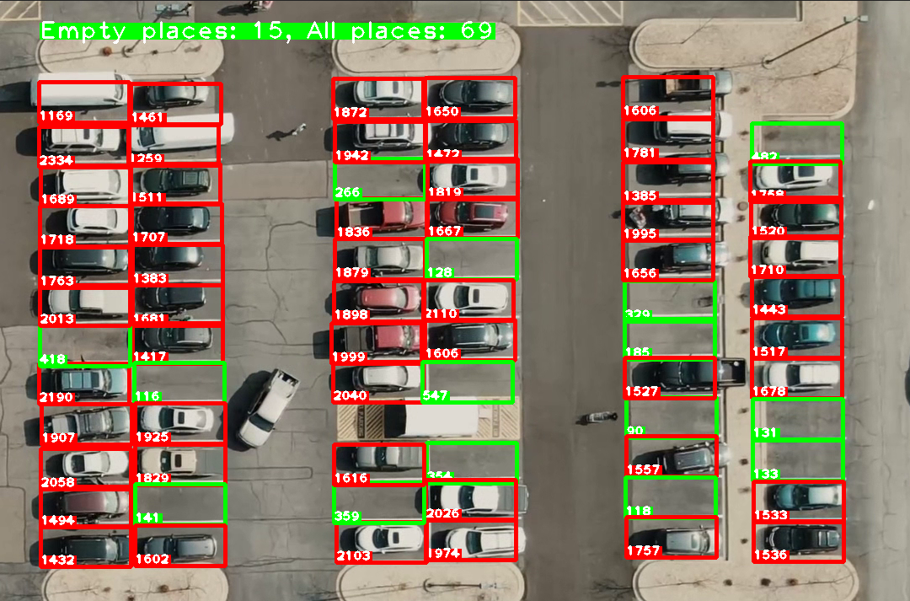

**Counter Empty Places on the Parking** 
>This script for counting and showing empty places in parking
>

> For more information
```
python manage.py --help
```
> Run this command for test video

```
python manage.py --run-detector ./assets/carPark.mp4
```

> For nonstop running add argument
```
--nonstop
```
> If you want to pick new parking places, pick places with left button on mouse.
> 
> If you want to delete some place, click one time right button.
```
python manage.py --run-picker
```
> If you have new things for this project connect me
```khtkarimzhonov@stud.etu.ru```
